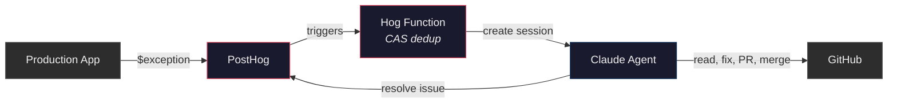
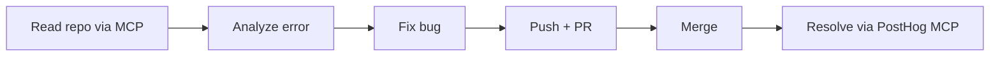
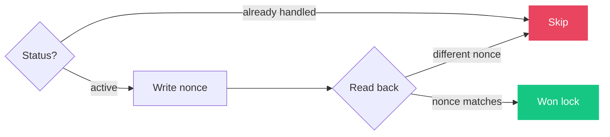
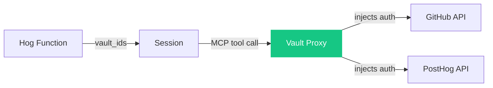

# How it works



### Agent session



## Files

| File | What it does | Key lines |
|---|---|---|
| [`agent.json`](agent.json) | Agent definition - model config, toolset | |
| [`system-prompt.md`](system-prompt.md) | Agent system prompt (~250 tokens, injected at deploy) | The entire "brain" |
| [`environment.json`](environment.json) | Cloud sandbox with unrestricted networking | |
| [`hog-function.hog`](hog-function.hog) | The glue - dedup, session creation, error details | Lines 46-68: CAS lock, Lines 83-96: session creation |
| [`setup.sh`](setup.sh) | Deploys agent + hog function to Anthropic + PostHog APIs | |
| [`.github/workflows/deploy.yml`](.github/workflows/deploy.yml) | Auto-deploys on push to main | |

## Lessons learned

### 1. Idempotency

Same exception fires 100x in seconds. Need exactly one agent session per error.

Status checks have TOCTOU races. Solution: **compare-and-swap** on the issue description.



Write a unique nonce, read it back. PostHog is last-write-wins, so only one writer's nonce survives. Loser backs off.

### 2. Secrets

Don't put tokens in the prompt. Use [Vaults](https://platform.claude.com/docs/en/agents/managed-agents/vaults) + MCP.



Vault stores credentials for both GitHub and PostHog. Agent declares MCP servers (no tokens). Session gets `vault_ids`. Proxy injects auth. Agent never sees any credentials.

### 3. Token efficiency

System prompt is sent every turn. Compress it.

```
Before (~500 tokens): "You are an autonomous bug-fixing agent. When you receive..."
After  (~250 tokens): "Autonomous bugfix agent. User msg has REPO, DEFAULT_BRANCH..."
```

Also strip duplicate instructions from the user message - don't repeat what the system prompt already says.

### 4. Prompt optimization from logs

The agent kept hitting the same avoidable issues every run, burning tokens. Fix: review session logs with Claude Code, identify repeated patterns, update the prompt to preempt them. This could be a scheduled "meta-agent" job.

### 5. Scaling to large codebases

Current setup uses MCP-only (reads files on demand via GitHub MCP). For larger repos where the agent needs to run tests or builds locally:

- **`init_script`**: Pre-clone the repo when the container starts. Agent wakes up with code on disk, can run tests.
