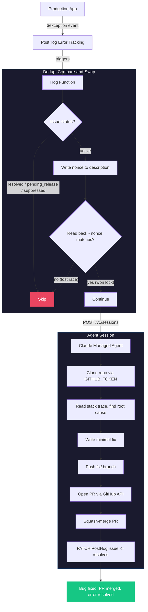

# How it works



## Files

| File | What it does | Key lines |
|---|---|---|
| [`agent.json`](agent.json) | Agent definition - model config, toolset | |
| [`system-prompt.md`](system-prompt.md) | Agent system prompt (~250 tokens, injected at deploy) | The entire "brain" |
| [`environment.json`](environment.json) | Cloud sandbox with unrestricted networking | |
| [`hog-function.hog`](hog-function.hog) | The glue - dedup, session creation, error details | Lines 46-68: CAS lock, Lines 83-96: session creation |
| [`setup.sh`](setup.sh) | Deploys agent + hog function to Anthropic + PostHog APIs | |
| [`.github/workflows/deploy.yml`](.github/workflows/deploy.yml) | Auto-deploys on push to main | |

## What was hard

### 1. Idempotency (one agent per error)

The same exception can fire hundreds of times in seconds. The Hog function needs to ensure exactly one agent session is created per error.

**First attempt**: Check PostHog issue status, then set `pending_release`. Problem: classic TOCTOU race. Two invocations both read `active`, both proceed.

**Second attempt**: Added Anthropic session title matching as a second layer. Better, but same fundamental race condition, just smaller window.

**Final approach**: Compare-and-swap (CAS) on the PostHog issue description field. Each invocation:
1. Quick check: skip if already `pending_release`/`resolved`/`suppressed`
2. Write a unique nonce (`bugfix-lock-{timestamp}-{event.uuid}`) to the issue description
3. Read back the issue description
4. If the nonce matches, we won the lock. If not, another invocation won - skip.

This works because PostHog's API is last-write-wins. Two concurrent writers will both succeed, but only one nonce survives the read-back. The loser sees a different nonce and backs off.

### 2. Token efficiency

The system prompt is sent on every agent turn. The original verbose prompt was ~500 tokens. Compressed to ~250 tokens using "caveman-style" - same instructions, stripped filler words.

```
Before: "You are an autonomous bug-fixing agent. When you receive an error report, follow these steps exactly..."
After:  "Autonomous bugfix agent. User msg has REPO, GITHUB_TOKEN..."
```

### 3. Agent runtime inefficiencies

The agent kept hitting the same avoidable issues every run - things like trying commands that don't exist in the sandbox, retrying failed approaches. These burned tokens without making progress.

Fix: ran Claude Code against the agent's session logs to identify repeated patterns, then updated the system prompt to preempt them. This is essentially **prompt optimization from production traces**.

This pattern - reviewing agent logs and feeding learnings back into the prompt - would be a good fit for a scheduled agent job. A "meta-agent" that periodically audits bugfix session logs and proposes prompt improvements.
