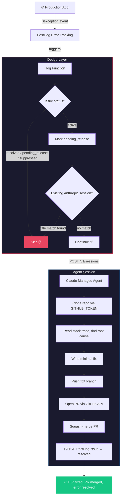

# How it works



## Files

| File | What it does | Key lines |
|---|---|---|
| [`agent.json`](agent.json) | Agent definition - compressed system prompt (~250 tokens), model config, toolset | System prompt is the entire "brain" |
| [`environment.json`](environment.json) | Cloud sandbox with unrestricted networking so the agent can clone repos and call APIs | |
| [`hog-function.hog`](hog-function.hog) | The glue - extracts exception data, deduplicates, creates agent session, sends error details | Lines 17-46: dedup logic, Lines 89-106: session creation |
| [`setup.sh`](setup.sh) | Deploys everything - creates/updates agent on Anthropic, updates Hog function on PostHog | Reads all env vars, handles create vs update |
| [`.github/workflows/deploy.yml`](.github/workflows/deploy.yml) | Auto-deploys on push to main | |

## Token cost

The system prompt is ~250 tokens (caveman-style compression). It's sent on every agent turn, so halving it roughly halves the per-session prompt overhead.

```
Before: ~500 tokens ("You are an autonomous bug-fixing agent. When you receive...")
After:  ~250 tokens ("Autonomous bugfix agent. User msg has REPO, GITHUB_TOKEN...")
```

## Dedup strategy

Two layers, neither perfect alone:

1. **PostHog issue status** - Check before, write `pending_release` immediately after. Blocks most duplicates but has a TOCTOU race window.
2. **Anthropic session title** - List existing sessions, skip if `{errorType}: {errorMessage}` matches. Catches the race condition but only checks page 1.

The combination handles the common case (same error firing 100x in 30 seconds) while being honest about edge cases.
