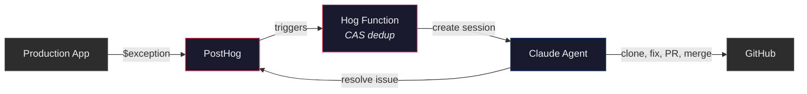
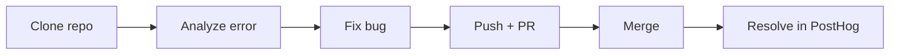
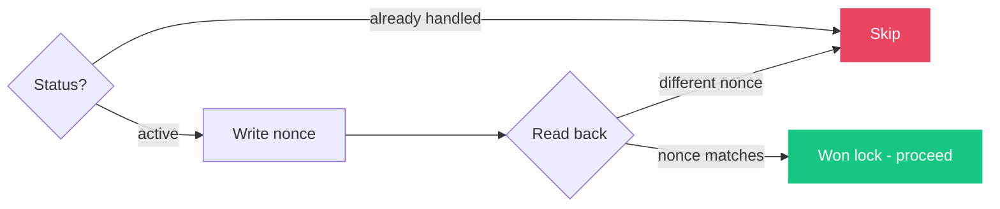
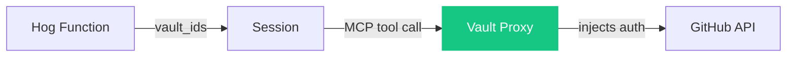

# How it works



### Agent session



## Files

| File | What it does | Key lines |
|---|---|---|
| [`agent.json`](agent.json) | Agent definition - model config, toolset | |
| [`system-prompt.md`](system-prompt.md) | Agent system prompt (~250 tokens, injected at deploy) | The entire "brain" |
| [`environment.json`](environment.json) | Cloud sandbox with unrestricted networking | |
| [`hog-function.hog`](hog-function.hog) | The glue - dedup, session creation, error details | Lines 46-68: CAS lock, Lines 83-96: session creation |
| [`setup.sh`](setup.sh) | Deploys agent + hog function to Anthropic + PostHog APIs | |
| [`.github/workflows/deploy.yml`](.github/workflows/deploy.yml) | Auto-deploys on push to main | |

## What was hard

### 1. Idempotency (one agent per error)

The same exception can fire hundreds of times in seconds. The [Hog function](hog-function.hog) needs to ensure exactly one agent session is created per error.

**First attempt**: Check PostHog issue status, then set `pending_release`. Problem: classic TOCTOU race. Two invocations both read `active`, both proceed.

**Second attempt**: Added Anthropic session title matching as a second layer. Better, but same fundamental race condition, just smaller window.

**Final approach**: Compare-and-swap (CAS) on the PostHog issue description field:



Each invocation writes a unique nonce (`bugfix-lock-{timestamp}-{event.uuid}`) to the issue description, then reads it back. PostHog's API is last-write-wins, so two concurrent writers both succeed, but only one nonce survives the read-back. The loser sees a different nonce and backs off.

### 2. Secrets management (Vaults + MCP)

Early versions passed `GITHUB_TOKEN` as plaintext in the user message. This meant the token was visible in Anthropic's session logs and the agent's conversation.

**Fix**: Anthropic's [Vaults](https://docs.anthropic.com/en/docs/agents/managed-agents/vaults) + GitHub MCP.



- A **Vault** stores the GitHub PAT as a `static_bearer` credential bound to `https://api.githubcopilot.com/mcp/`
- The **agent** declares a GitHub MCP server in its config - no token, just the URL
- At **session creation**, the Hog function passes `vault_ids` - linking the session to the credential
- MCP tool calls go through a **vault proxy** that injects the token - the agent never sees it
- The token never appears in the prompt, conversation, or session logs

The agent uses GitHub MCP tools (`get_file_contents`, `create_branch`, `create_pull_request`, etc.) instead of `git clone` + `curl`.

**Remaining gap**: the PostHog API key is still in the user message (needed for `curl` to resolve the error). This could be vaulted too if PostHog had an MCP server the agent could use.

### 3. Token efficiency

The system prompt is sent on every agent turn. The original verbose prompt was ~500 tokens. Compressed to ~250 tokens using "caveman-style" - same instructions, stripped filler words.

```
Before: "You are an autonomous bug-fixing agent. When you receive an error report, follow these steps exactly..."
After:  "Autonomous bugfix agent. User msg has REPO, GITHUB_TOKEN..."
```

### 4. Agent runtime inefficiencies

The agent kept hitting the same avoidable issues every run - things like trying commands that don't exist in the sandbox, retrying failed approaches. These burned tokens without making progress.

Fix: ran Claude Code against the agent's session logs to identify repeated patterns, then updated the system prompt to preempt them. This is essentially **prompt optimization from production traces**.

This pattern - reviewing agent logs and feeding learnings back into the prompt - would be a good fit for a scheduled agent job. A "meta-agent" that periodically audits bugfix session logs and proposes prompt improvements.

### 5. Large codebases

The current setup works well for small repos (Nexus Games is vanilla HTML/CSS/JS). For larger codebases, every session would spend significant time and tokens just on setup.

Two approaches to solve this:

- **`init_script`**: The environment config supports an `init_script` that runs when the container spins up, before the agent starts. Pre-clone the repo, install dependencies, run builds - the agent wakes up with everything on disk. This is how Sentry's integration works at scale.
- **MCP-only (no clone)**: Our current vault-based setup already uses GitHub MCP tools (`get_file_contents`, `search_code`) instead of `git clone`. The agent only fetches the files it needs. For a monorepo with millions of lines, this is far more efficient than cloning - but the agent can't run tests or builds locally.

The ideal setup for a large codebase would combine both: `init_script` pre-clones and builds, the agent uses MCP for reading code (fast, targeted), and falls back to the local clone for running tests and builds.
