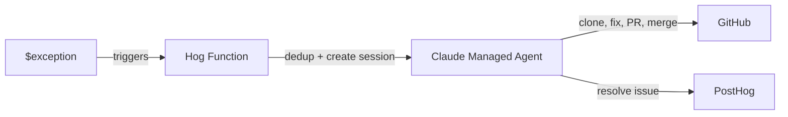

# posthog-bugfix-agent

Automated bug-fixing pipeline: PostHog captures an exception, a Hog function creates a [Claude Managed Agent](https://docs.anthropic.com/en/docs/agents/managed-agents) session that clones the repo, fixes the bug, opens + merges a PR, and resolves the error in PostHog.

## Architecture

See [OVERVIEW.md](OVERVIEW.md) for the full diagram, file map, and design notes.



## Components

| File | Description |
|---|---|
| [`agent.json`](agent.json) | Claude Managed Agent definition (model, tools) |
| [`system-prompt.md`](system-prompt.md) | Agent system prompt (readable markdown, injected at deploy) |
| [`environment.json`](environment.json) | Agent execution environment (cloud, unrestricted networking) |
| [`hog-function.hog`](hog-function.hog) | PostHog Hog function that bridges exceptions to the agent |
| [`setup.sh`](setup.sh) | Deploys/updates all components via Anthropic + PostHog APIs |
| [`.github/workflows/deploy.yml`](.github/workflows/deploy.yml) | Auto-deploys on push to main |

## How dedup works

The Hog function uses compare-and-swap (CAS) on the PostHog error issue to ensure exactly one agent session per error:

1. **Quick check**: Skip if issue is already `pending_release`, `resolved`, or `suppressed`
2. **Write nonce**: Write a unique nonce (`bugfix-lock-{timestamp}-{event.uuid}`) to the issue description and set `pending_release`
3. **Read back**: Read the issue description back. If the nonce matches, we won the lock. If another invocation overwrote it, we lost - skip.

See [OVERVIEW.md](OVERVIEW.md) for the full breakdown of why simpler approaches didn't work.

## Setup

### Prerequisites

- [Anthropic API key](https://console.anthropic.com/) with Managed Agents access (beta: `managed-agents-2026-04-01`)
- [PostHog personal API key](https://us.posthog.com/settings/user-api-keys) (`phx_...`) with Hog function write access
- GitHub token with `repo` scope (push + PR permissions) for the target repository
- A PostHog project with error tracking enabled and a Hog function already created (setup.sh updates via PATCH, it does not create the function from scratch)

### Create a vault for GitHub credentials

GitHub credentials are stored in an Anthropic [Vault](https://platform.claude.com/docs/en/agents/managed-agents/vaults) - they never appear in the agent prompt or session logs. The agent accesses GitHub through MCP tools, and the vault proxy handles auth.

```bash
# Create a vault
curl -X POST https://api.anthropic.com/v1/vaults \
  -H "x-api-key: $ANTHROPIC_API_KEY" \
  -H "anthropic-version: 2023-06-01" \
  -H "anthropic-beta: managed-agents-2026-04-01" \
  -H "content-type: application/json" \
  -d '{"display_name": "posthog-bugfix-agent"}'
# => Save the vault ID (vlt_...)

# Register your GitHub token in the vault
curl -X POST https://api.anthropic.com/v1/vaults/YOUR_VAULT_ID/credentials \
  -H "x-api-key: $ANTHROPIC_API_KEY" \
  -H "anthropic-version: 2023-06-01" \
  -H "anthropic-beta: managed-agents-2026-04-01" \
  -H "content-type: application/json" \
  -d '{"display_name": "GitHub", "auth": {"type": "static_bearer", "mcp_server_url": "https://api.githubcopilot.com/mcp/", "token": "YOUR_GITHUB_TOKEN"}}'
```

Set the vault ID as the `vaultId` input in your Hog function.

### First-time deploy

On first run, the script creates the agent and environment and prints their IDs. Save these for future deploys.

```bash
export ANTHROPIC_API_KEY="sk-ant-..."
export POSTHOG_API_KEY="phx_..."
export POSTHOG_PROJECT_ID="12345"
export POSTHOG_FUNCTION_ID="your-hog-function-uuid"

chmod +x setup.sh
./setup.sh
# => Agent created: agent_...
# => Environment created: env_...
# Save these IDs!
```

### Subsequent deploys

Set the agent and environment IDs so the script updates instead of recreating:

```bash
export AGENT_ID="agent_..."
export ENVIRONMENT_ID="env_..."
./setup.sh
```

### Deploy via GitHub Actions

The included workflow auto-deploys when `agent.json`, `environment.json`, `hog-function.hog`, or `setup.sh` change on main. It also supports manual triggers.

Add these as [repository secrets](https://docs.github.com/en/actions/security-for-github-actions/security-guides/using-secrets-in-github-actions):

```bash
gh secret set ANTHROPIC_API_KEY
gh secret set POSTHOG_API_KEY
gh secret set POSTHOG_PROJECT_ID
gh secret set POSTHOG_FUNCTION_ID
gh secret set AGENT_ID        # after first deploy
gh secret set ENVIRONMENT_ID  # after first deploy
```

### Hog function inputs

Configure these in the PostHog UI for the Hog function (or they're deployed via `inputs_schema` in setup.sh):

| Input | Description |
|---|---|
| `anthropicApiKey` | Anthropic API key for creating agent sessions |
| `vaultId` | Claude Vault ID containing GitHub credentials (see below) |
| `githubRepo` | GitHub repo, e.g. `owner/repo` |
| `defaultBranch` | Default branch name, e.g. `main` |
| `posthogApiKey` | PostHog personal API key (for resolving error tracking issues) |
| `posthogProjectId` | PostHog project ID |
| `agentId` | Claude Managed Agent ID |
| `environmentId` | Claude Environment ID |
| `gitAuthorName` | Git commit author name (e.g. `Brooker's Bugfix Agent`) |
| `gitAuthorEmail` | Git commit author email (e.g. `you+bugfix-agent@users.noreply.github.com`) |

## Known limitations

- **CAS is best-effort**: The compare-and-swap uses PostHog's API which is last-write-wins, not truly atomic. In theory two writes could interleave, but in practice the write-then-read window is small enough that duplicates are extremely rare.
- **PostHog API key in message text**: The PostHog API key is still passed in the user message for resolving error tracking issues. GitHub credentials are handled securely via Vaults.

## License

MIT
