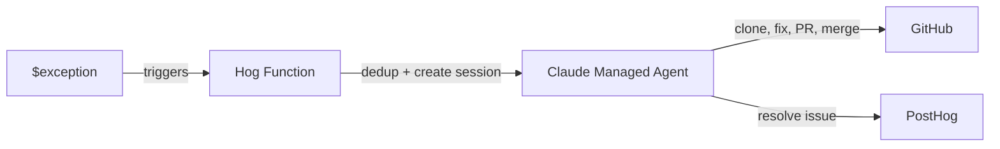

# posthog-bugfix-agent

Automated bug-fixing pipeline: PostHog captures an exception, a Hog function creates a [Claude Managed Agent](https://docs.anthropic.com/en/docs/agents/managed-agents) session that clones the repo, fixes the bug, opens + merges a PR, and resolves the error in PostHog.

## Architecture

See [OVERVIEW.md](OVERVIEW.md) for the full diagram, file map, and design notes.



## Components

| File | Description |
|---|---|
| [`agent.json`](agent.json) | Claude Managed Agent definition (model, tools) |
| [`system-prompt.md`](system-prompt.md) | Agent system prompt (readable markdown, injected at deploy) |
| [`environment.json`](environment.json) | Agent execution environment (cloud, unrestricted networking) |
| [`hog-function.hog`](hog-function.hog) | PostHog Hog function that bridges exceptions to the agent |
| [`setup.sh`](setup.sh) | Deploys/updates all components via Anthropic + PostHog APIs |
| [`.github/workflows/deploy.yml`](.github/workflows/deploy.yml) | Auto-deploys on push to main |

## How dedup works

The Hog function prevents duplicate agent sessions with two layers:

1. **PostHog issue status**: Before creating a session, it checks the error tracking issue status. If the issue is already `pending_release`, `resolved`, or `suppressed`, it skips. Immediately after passing this check, it marks the issue as `pending_release` to block subsequent events.

2. **Anthropic session title matching**: As a second layer (catches race conditions), it lists recent Anthropic sessions and skips if one already exists with a matching `{errorType}: {errorMessage}` title.

## Setup

### Prerequisites

- [Anthropic API key](https://console.anthropic.com/) with Managed Agents access (beta: `managed-agents-2026-04-01`)
- [PostHog personal API key](https://us.posthog.com/settings/user-api-keys) (`phx_...`) with Hog function write access
- GitHub token with `repo` scope (push + PR permissions) for the target repository
- A PostHog project with error tracking enabled and a Hog function already created (setup.sh updates via PATCH, it does not create the function from scratch)

### First-time deploy

On first run, the script creates the agent and environment and prints their IDs. Save these for future deploys.

```bash
export ANTHROPIC_API_KEY="sk-ant-..."
export POSTHOG_API_KEY="phx_..."
export POSTHOG_PROJECT_ID="12345"
export POSTHOG_FUNCTION_ID="your-hog-function-uuid"

chmod +x setup.sh
./setup.sh
# => Agent created: agent_...
# => Environment created: env_...
# Save these IDs!
```

### Subsequent deploys

Set the agent and environment IDs so the script updates instead of recreating:

```bash
export AGENT_ID="agent_..."
export ENVIRONMENT_ID="env_..."
./setup.sh
```

### Deploy via GitHub Actions

The included workflow auto-deploys when `agent.json`, `environment.json`, `hog-function.hog`, or `setup.sh` change on main. It also supports manual triggers.

Add these as [repository secrets](https://docs.github.com/en/actions/security-for-github-actions/security-guides/using-secrets-in-github-actions):

```bash
gh secret set ANTHROPIC_API_KEY
gh secret set POSTHOG_API_KEY
gh secret set POSTHOG_PROJECT_ID
gh secret set POSTHOG_FUNCTION_ID
gh secret set AGENT_ID        # after first deploy
gh secret set ENVIRONMENT_ID  # after first deploy
```

### Hog function inputs

Configure these in the PostHog UI for the Hog function (or they're deployed via `inputs_schema` in setup.sh):

| Input | Description |
|---|---|
| `anthropicApiKey` | Anthropic API key for creating agent sessions |
| `githubToken` | GitHub PAT or app token for cloning/pushing |
| `githubRepo` | GitHub repo, e.g. `owner/repo` |
| `defaultBranch` | Default branch name, e.g. `main` |
| `posthogApiKey` | PostHog personal API key (for resolving error tracking issues) |
| `posthogProjectId` | PostHog project ID |
| `agentId` | Claude Managed Agent ID |
| `environmentId` | Claude Environment ID |
| `gitAuthorName` | Git commit author name (e.g. `Brooker's Bugfix Agent`) |
| `gitAuthorEmail` | Git commit author email (e.g. `you+bugfix-agent@users.noreply.github.com`) |

## Known limitations

- **Race condition window**: There's a small TOCTOU gap between reading the PostHog issue status and writing `pending_release`. Two near-simultaneous exceptions could both pass the check. The Anthropic session title dedup is a mitigation but has the same theoretical gap.
- **Session list pagination**: The Anthropic session dedup only checks the first page of sessions. Very old matching sessions on later pages would be missed.
- **Tokens in message text**: The GitHub token and PostHog API key are passed as plaintext in the user message to the agent. This is inherent to the architecture since the agent needs them for git operations and API calls.

## License

MIT
