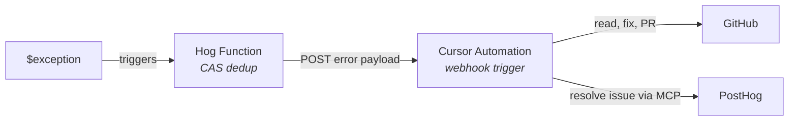

# Cursor backend

Same pipeline as the root [Claude Managed Agent](../README.md) version, but the agent that fixes the bug is a **Cursor Cloud Agent** driven by a [Cursor Automation](https://cursor.com/docs/cloud-agent/automations) instead of the Anthropic Managed Agents API.



## Why this one is thinner

In the Claude version the Hog function does everything: creates the agent session, passes the repo, branch, and credentials, and holds the prompt. With Cursor, almost all of that lives **inside the Cursor automation** (repo, branch, prompt, GitHub auth, PostHog MCP, model, tools). So the Hog function here only dedups the error and forwards it. That is the whole point of the integrations tier: the trigger is a thin POST, the agent config is owned on Cursor's side.

## What lives where

| Concern | Lives in |
|---|---|
| Webhook trigger + API key | Cursor automation |
| Repo + branch to work in | Cursor automation (repo config) |
| Agent prompt | Cursor automation (paste [`automation-prompt.md`](automation-prompt.md)) |
| GitHub auth + "Open pull request" tool | Cursor automation (native GitHub integration) |
| PostHog MCP (to resolve the issue) | Cursor automation (add as MCP tool) |
| CAS dedup + forwarding the error | [`hog-function-cursor.hog`](hog-function-cursor.hog) |

## Setup

### 1. Create the Cursor automation

In the Cursor dashboard, create an automation with:

- **Trigger**: Webhook. Save the automation, then copy the generated **webhook URL** and **API key**.
- **Repository**: the repo to fix (e.g. `MattBro/posthog-bugfix-agent`) and the default branch.
- **Tools**: enable "Open pull request" (and "Comment on pull request" if you want it to annotate). Add the **PostHog MCP** as an MCP tool so the agent can resolve the error tracking issue.
- **Prompt**: paste [`automation-prompt.md`](automation-prompt.md).
- **Permissions**: Team Owned if you want it billed to the team and runnable by the org.

Two things to confirm against the curl snippet Cursor shows you when you save:

1. **Auth header.** This function sends `Authorization: Bearer <apiKey>`, matching the rest of the [Cursor API](https://cursor.com/docs/api). If the UI shows a different header, update the `headers` block in [`hog-function-cursor.hog`](hog-function-cursor.hog).
2. **Payload passthrough.** The agent reads fields from the POSTed JSON body. Confirm the automation surfaces the body to the prompt (the [automations docs](https://cursor.com/docs/cloud-agent/automations) list monitoring tools as a webhook use case, so the body is the agent's input).

### 2. Deploy the Hog function

You need a separate PostHog Hog function for this (its own `POSTHOG_FUNCTION_ID`), triggered on `$exception`. Then:

```bash
export POSTHOG_API_KEY="phx_..."
export POSTHOG_PROJECT_ID="12345"
export POSTHOG_FUNCTION_ID="your-cursor-hog-function-uuid"
./cursor/setup-cursor.sh
```

Set these inputs on the Hog function (deployed via `inputs_schema` in `setup-cursor.sh`):

| Input | Description |
|---|---|
| `cursorWebhookUrl` | Webhook URL from step 1 |
| `cursorApiKey` | Webhook API key from step 1 |
| `posthogApiKey` | PostHog personal API key (for the CAS dedup) |
| `posthogProjectId` | PostHog project ID |
| `githubRepo` | `owner/repo` (passthrough; the automation also has this) |
| `defaultBranch` | e.g. `main` |

## Caveat: don't run both backends on the same error stream

Both the Claude and Cursor Hog functions write the same CAS nonce to the issue `description` and flip it to `pending_release`. If both are attached to the same project's `$exception` events they will fight over the lock and one will always lose. Pick one backend per project, or point them at different projects, when demoing.
