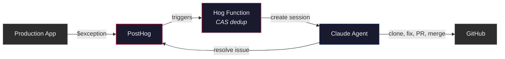
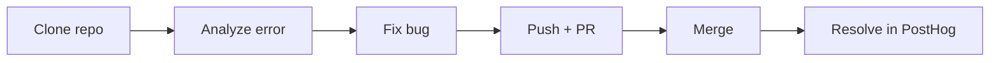

# Architecture

```mermaid
flowchart LR
    A["Production App"] -- "$exception" --> B["PostHog"]
    B -- "triggers" --> C["Hog Function<br/><i>CAS dedup</i>"]
    C -- "create session" --> D["Claude Agent"]
    D -- "clone, fix, PR, merge" --> E["GitHub"]
    D -- "resolve issue" --> B

    style A fill:#2d2d2d,stroke:#555,color:#eee
    style B fill:#1a1a2e,stroke:#e94560,color:#eee
    style C fill:#1a1a2e,stroke:#e94560,color:#eee
    style D fill:#1a1a2e,stroke:#0f3460,color:#eee
    style E fill:#2d2d2d,stroke:#555,color:#eee
```

### Agent session

```mermaid
flowchart LR
    A["Clone repo"] --> B["Analyze error"] --> C["Fix bug"] --> D["Push + PR"] --> E["Merge"] --> F["Resolve in PostHog"]
```
