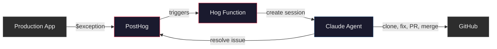
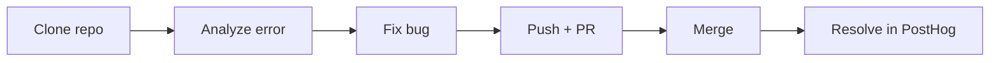

# What are we building?

A bug fixes itself: error happens in production, a PR gets opened and merged, the error gets resolved. No human involved.

## The problem

Errors fire at 3am. Someone gets paged, opens the error, reads the stack trace, finds the bug, writes a fix, opens a PR, merges it. What if that whole loop was automated?

## The building blocks

- **PostHog Error Tracking** - captures `$exception` events from your app with stack traces
- **Hog Functions** - PostHog's serverless functions (like AWS Lambda but triggered by PostHog events). Write code that runs when specific events fire.
- **Claude Managed Agents** - Anthropic's hosted agent runtime. You define an agent (model + tools + system prompt), create a session, send it a message, and it works autonomously in a sandboxed cloud container.

## Architecture

### Agent session

