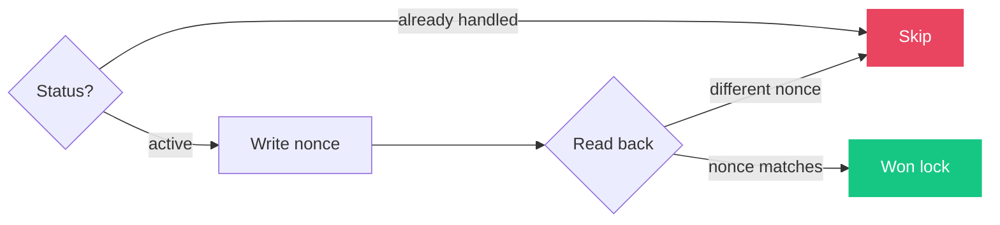

# Lesson 1: Idempotency

Same exception fires 100x in seconds. Need exactly one agent session per error.

Status checks have TOCTOU races. Solution: **compare-and-swap** on the issue description.

Write a unique nonce, read it back. PostHog is last-write-wins, so only one writer's nonce survives. Loser backs off.
