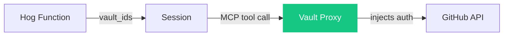

# Lesson 2: Secrets

Don't put tokens in the prompt. Use [Vaults](https://docs.anthropic.com/en/docs/agents/managed-agents/vaults) + GitHub MCP.

Vault stores the PAT. Agent declares MCP server (no token). Session gets `vault_ids`. Proxy injects auth. Agent never sees the token.
